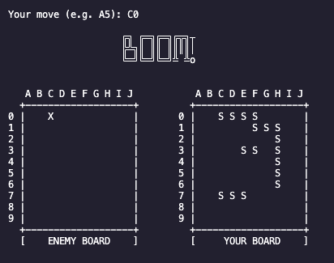

# Battleshipy



A Python-based implementation of the classic Battleship game with network multiplayer support. Players can compete against each other over a local network in this traditional naval combat game.

## Features

- Multiplayer gameplay over TCP/IP
- Interactive command-line interface
- Random ship placement
- Real-time game state visualization
- Network error handling and graceful disconnection

## Prerequisites

- Python 3.x
- Basic understanding of network connectivity (IP addresses and ports)

## Installation

1. Clone or download this repository to your local machine
2. No additional packages are required as the game uses Python's standard library

## How to Run

### Starting the Server

1. Open a terminal window
2. Navigate to the game directory
3. Run the server:
```bash
python3 server.py
```
4. The server will display the IP address and port number it's listening on

### Starting a Client

1. Open a new terminal window
2. Navigate to the game directory
3. Run the client:
```bash
python3 client.py
```
4. When prompted, enter the server's IP address and port number

## How to Play

1. The game begins once two players are connected
2. Each player's ships are randomly placed on their board
3. Players take turns to attack their opponent's grid:
   - Enter coordinates in the format `A5`, `B3`, etc.
   - `X` marks a hit
   - `O` marks a miss
   - `#` represents your ships
   - `~` represents water
4. The game continues until one player sinks all of their opponent's ships

## Game Board Layout

- The game board is a 10x10 grid
- Columns are labeled A-J
- Rows are labeled 1-10
- Ships in the game:
  - Carrier (5 spaces)
  - Battleship (4 spaces)
  - Cruiser (3 spaces)
  - Submarine (3 spaces)
  - Destroyer (2 spaces)

## Network Setup Tips

- For local network play, use the server's local IP address
- Ensure both players are on the same network
- Check firewall settings if connection issues occur

## Error Handling

- The game includes robust error handling for:
  - Invalid moves
  - Network disconnections
  - Improper input formats

## License

This project is licensed under the MIT License - see the [LICENSE](LICENSE) file for details. This means you can:
- Use this code commercially
- Modify the code
- Distribute the code
- Use the code privately
- Sublicense the code

All while maintaining the original copyright notice.

## Contributing

Feel free to fork this repository and submit pull requests for any improvements!